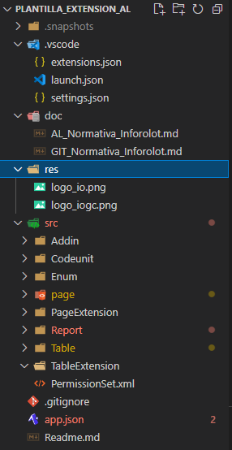
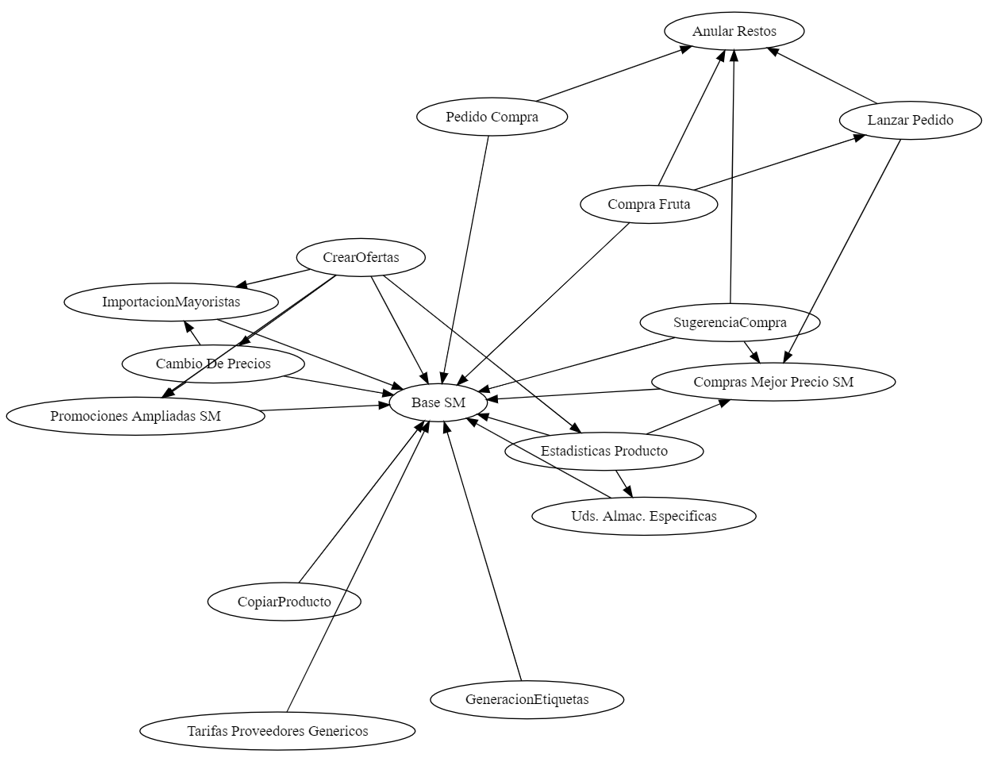

# Normativa Inforolot para la programación d'extensiones en AL

Al crear una extensión he detectado las siguientes necesidades las
cuales debería **establecerse un protocolo**, y de esa forma unificar su
programación.
Esta normativa interna siempre seguirá como guía las [mejores prácticas propuestas por Microsoft para la programación AL](https://docs.microsoft.com/es-es/dynamics365/business-central/dev-itpro/compliance/apptest-bestpracticesforalcode)

## Nomenclatura extensiones

1. El nombre de la carpeta raíz de la extensión será siempre un nombre identificativo de la solución que aporta la extensión
2. El nombre de la carpeta raíz de la extensión usará nomenclatura PascalCase

### Ejemplos

- MejorPrecio
- TerminarPedido
- Expediciones

3. El nombre de la extensión definida mediante el atributo "name" del fichero [app.json](app.json) será con espacios y mayúsculas en cada palabra.

### Ejemplos

- Comprobacion SII
- Mejor Precio
- Terminar Pedido
  
4. El nombre para la extensión base para una instalación de cliente que contendrá campos, y funcionalidades no específicas o empaquetables en una funcionalidad determinada se llamara **Base**

## Estructura directorios

1. Todas las extensiones se realizarán con la misma estructura de
directorios y utilizando los mismos nombres. Se usará la [Plantilla Extension AL](../Readme.md) que ya dispone del contenido estructurado en directorios.

## Identificador de extensión

Cada extensión tendrá un identificador especifico de la extensión que será útil para dar nombre a distintos objetos y ficheros

1. Se definirá mediante las iniciales del nombre de la extensión.
2. Debe constar de 3 letras

### Ejemplo

- Gestión Riesgo Clientes => GRC
- Terminar Pedido => TPE
- Compras Mejor Precio => CMP
- Crear Ofertas => COF

## Nomenclatura de Objetos

1. Para los objetos de la extensión con el nombre y el prefijo que le
corresponde (IOSTD, IOGC) y un nombre único tendrían que ser suficiente.

### Ejemplo

- Codeunit 50110 "IOSTD Gestion Riesgo Cliente"

2. En los objetos de tipo Extension se usará el identificador de extensión. De esta forma se evitan problemas de nomenclatura entre otras extensiones que heredan el mismo objeto.

### Ejemplo

Supongamos que tanto la extensión *Compras Mejor precio* como la extensión *Crear Ofertas* tienen un TableExtension de la tabla Sales Price.
Si no usáramos el Identificador de extensión, dicho objeto tendría el nombre **IOSTD Sales Price** en ambas extensiones.  
Mediante el uso del identificador de extensión en los objetos de tipo *Extension* en el ejemplo anterior tendremos 2 nombres de objeto distintos:

- Compras Mejor Precio => **TableExtension 50001 "IOSTD Sales Price CMP" extends Sales Price**

- Crear Ofertas => **TableExtension 50002 "IOSTD Sales Price COF" extends Sales Price**

## Nomenclatura ficheros

La nomenclatura de ficheros ser realizará siguiendo las recomendaciones proporcionadas por Microsoft.
Actualmente la estructura de ficheros es:
**PrefijoEmpresaNombreObjeto.TipoObjetoCorto.al**

### Ejemplo

- Codeunit 50000 "IOSTD GestionarTransportes" => IOSTDGestionarTransportes.Codeunit.al

- TableExtension 50001 "IOSTD Item List BSM" => IOSTDItemListBSM.PageExt.al
  
*Para más información revisar [la recomendación de Microsoft](https://docs.microsoft.com/en-us/dynamics365/business-central/dev-itpro/compliance/apptest-bestpracticesforalcode#file-naming-examples)*

*Se recomienda el uso del plugin [Waldo's CRS AL Language Extension](https://marketplace.visualstudio.com/items?itemName=waldo.crs-al-language-extension)* para autogenerar los nombres de fichero al guardar el archivo con un nombre de objeto concreto. En el fichero de configuracion [settings.json](../.vscode/settings.json) de la plantilla Extension AL se puede encontrar un ejemplo de configuración. Este plugin se encuentra dentro del paquete [AL Extension Pack](https://marketplace.visualstudio.com/items?itemName=waldo.al-extension-pack), un paquete de extensiones recomendadas para falcilitar el trabajo de desarrollo de código AL desde Visual Studio Code.

## Plantilla base para la creación de nueva extensión

Al crear una extensión nueva, siempre se utilizará una definición de
directorios, ficheros y objetos base.

En la base deberá existir la estructura de directorios correcta, un
ejemplo de cada objeto (Codeunit, Page, PageExt, Report, Table,
TableExt) y la definición base de propiedades, variables campos,
estructuras mínimas para agilizar la programación.

Esta plantilla se puede encontrar [aquí](https://dev.azure.com/INFOROLOT/Plantillas_IO/_git/Plantilla_Extension_AL)

## Excel extensiones y numeraciones utilizadas**

Se documentará para cada extensión el rango de objetos utilizados.

## Diagrama extensiones en carpeta cliente**

En la carpeta de cada cliente se deberá documentar el diagrama con las
extensiones utilizadas, ya sean propias del cliente o de Inforolot.
*Una buena manera de generar este diagrama es mediante el uso del plugin [Waldo's CRS AL Language Extension](https://marketplace.visualstudio.com/items?itemName=waldo.crs-al-language-extension)*

## Protocolo repositorio

La normativa y protocolo para trabajar con el repositorio GIT de codigofuente se puede encontrar [aquí](GIT_Normativa_Inforolot.md)

## Pautas para el desarrollo

**PENDIENTE REDACTAR**
    -   Definición variables

    -   Definición funciones

    -   Definición eventos

    -   Definición funciones subscritas a eventos

    -   Etc...
